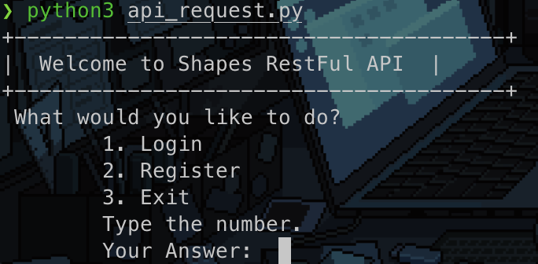
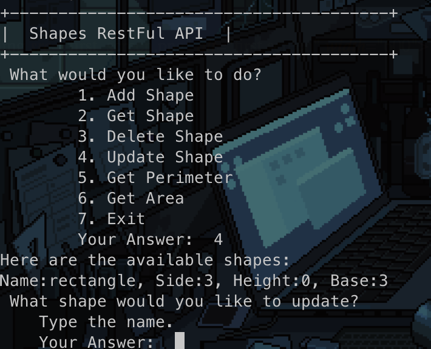

# Shapes RESTful API Project

Create a   RESTful API that will allow:

1. User Registration
2. User Login
3. User can CRUD shapes of type:
   * Triangle
   * Rectangle
   * Square
   * Diamond
4. User can request for shapes (note: these should be computed on the fly):
    * Area
    * Peremiter

## Project Approach

1. I used Django 3.2, sqlite, and django rest framework to create the API.
2. On data modeling, I used:
    * Name
    * Base
    * Height
    * Side
    As an attribute of the shape. 
3. In adding of shapes, I just restricted it to four types to simplify the database.
4. The api_request.py file contains how the user can communicate with the API. Use python 3.6+ to run the file.
5. To view the data, you can use the api_request.py or the Django Admin. Meaning,
all users will be automatically registered as superuser and is_staff.

## Installation
To start. Clone this repository on your respective directory.

`git clone https://github.com/jpeternantonio/shapeAPI_project.git`

The project use Docker to containerize the application. Make sure you have Docker installed on your machine. Run the following command:

This will install the needed dependencies for the project.

`docker build -t "shapes" .`

This will create the database and run the server. I use port 8001 just in case your local machine is running on port 8000.

`docker-compose up`

You can use also python environment as a container and install the requirements.txt file.

## Running the project
Once you successfully installed the project, and the server is running, type the following command:

`python api_request.py`

This will automatically check if the server is online/offline and show you options how to proceed. You will be using number or letter to select the option. Here are the screenshots below:

 

## Others
The project is not intended for production. This is just a simple project in a development environment.